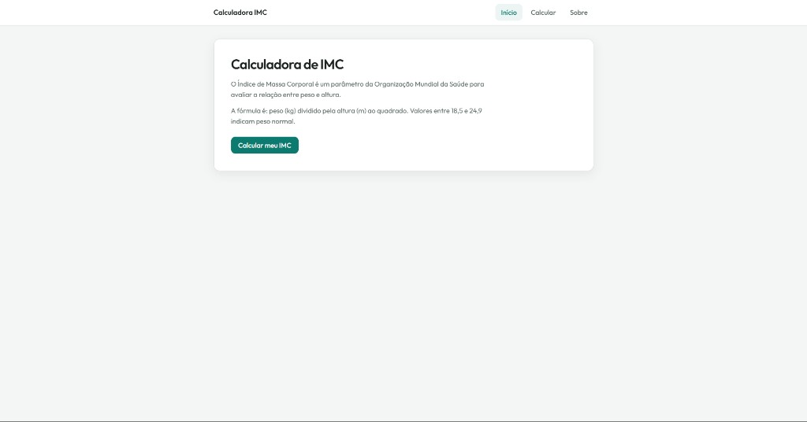

# Calculadora de IMC

Projeto de estudo em **Nuxt.js 2** que implementa uma calculadora de **Índice de Massa Corporal (IMC)** com persistência no **localStorage** — sem backend.

Este repositório nasceu como um **projeto legado** de aprendizado (CRUD simples) e foi **atualizado com pair programming assistido por IA**: correções de bugs, organização do código, design responsivo, animações leves e documentação dos conceitos do Nuxt/Vue.



## Propósito

O objetivo não é ser um produto clínico, e sim **testar e aplicar conceitos básicos do Nuxt.js** em um fluxo completo:

- File-based routing (`pages/`)
- Layouts compartilhados
- Componentes reutilizáveis (`props` / `emit`)
- Ciclo de vida (`created`)
- TypeScript em componentes e utilitários
- Navegação SPA (`nuxt-link`, rotas dinâmicas `pages/edit/_id.vue`)
- Persistência client-side com `localStorage` como “banco de dados”

## Funcionalidades

- Cálculo de IMC (peso em kg, altura em metros ou centímetros)
- Classificação por faixa (OMS)
- CRUD local: criar, listar, editar e excluir registros
- Interface responsiva (tabela no desktop, cards no mobile)

## Stack

| Tecnologia | Uso |
|------------|-----|
| [Nuxt 2](https://nuxt.com/docs/2.x) | Framework Vue com convenções de pasta |
| Vue 2.7 + TypeScript | Componentes e tipagem |
| Bulma (CDN) | Base de componentes |
| CSS customizado | Tema, responsividade e motion |
| localStorage | Persistência dos registros |

## Como rodar

**Requisitos:** Node.js 16+ (recomendado) ou Node 17+ com o script já configurado (`--openssl-legacy-provider` para compatibilidade com Webpack 4).

```bash
npm install
npm run dev
```

Acesse [http://localhost:3000](http://localhost:3000).

Outros comandos:

```bash
npm run build    # build de produção
npm run generate # export estático
npm run lint     # ESLint
```

## Estrutura do projeto

```
├── assets/css/       # Estilos globais
├── components/       # Form, Table, Buttons
├── docs/             # Imagens e documentação
├── interface/        # Tipos TypeScript (IPessoa)
├── layouts/          # Layout padrão + navegação
├── pages/            # Rotas (index, create, edit, remove, about)
└── utils/            # Cálculo de IMC e camada de storage
```

## Histórico

- Versão inicial: exercício legado para praticar Nuxt e CRUD com `localStorage`
- Evolução: refatoração guiada por IA (cálculo de IMC, rotas dinâmicas, storage centralizado, UI/UX e animações acessíveis)

## Licença

Projeto educacional — uso livre para estudo.
